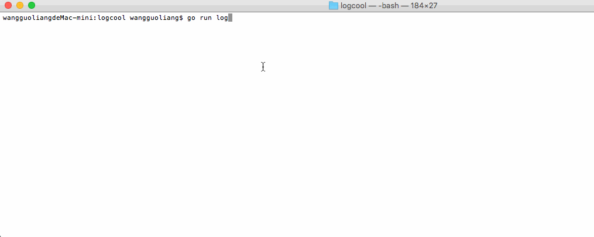

# Logcool 

Logcool is an open source project to collect, filter ,transfer and response any log or event-flow data as a lightweight system.[中文](./docs/README_ZH.md)

Logcool's design learn from Heka and Logstash and it's implementation was inspired by gogstash. What's more, the logcool's goal is to be a completely independent project and not much rely on other non-standard libiaries.

Because it is difficult to fully meet the needs of different services, this repository provides basic plugins, such as encryption and decryption of data, compression and decompression of data, data format conversion, support files, command line, http, or the output of any system or redis, influxDB, MySQL database and so on. Importantly, you can easily develop a plugin according to your needs, and easily use it.

You can use logcool in any way.

## Getting started

Logcool can collect all-types los or event-flow data, and support some input/output types.Besides,you can  new your's plugs if you need it. To get started, [check out the installation instructions in the documentation](https://godoc.org/github.com/wgliang/logcool).

## Using Example

A easy stdin2stdout example. 

## Plugins

Some plugins that had finished and will develope in the future.

### input
- [file](https://github.com/wgliang/logcool/tree/master/input/file) Source data from files.
- [stdin](https://github.com/wgliang/logcool/tree/master/input/stdin) Source data from console.
- [http](https://github.com/wgliang/logcool/tree/master/input/stdin) Source data from http.
- [collectd](https://github.com/wgliang/logcool/tree/master/input/collectd) Monitor and collect system performance data.

### filter
- [zeus](https://github.com/wgliang/logcool/tree/master/filter/zeus)
- metrics

### codec
- aes
- zip
- json

### output
- [stdout](https://github.com/wgliang/logcool/tree/master/output/stdout)
- [redis](https://github.com/wgliang/logcool/tree/master/output/redis)
- influxdb
- mysql
- pg

## Versions

[versions](https://github.com/wgliang/logcool/blob/master/docs/VERSION_UPDATE.md)

## Other Contributor

Logcool learn from gogstash much. Thank you for your contribution, and I also learn a lot from your project. @tsaikd

## Licensing

Logcool is licensed under the Apache License, Version 2.0. See LICENSE for the full license text.

## Welcome to Contribute

1.Fork it
2.Create your feature branch
3.Commit your changes (git commit -am 'Add some feature'),and no test error.
4.Push to the branch
5.Create new Pull Request

Documentation or correcting comments are also welcome.