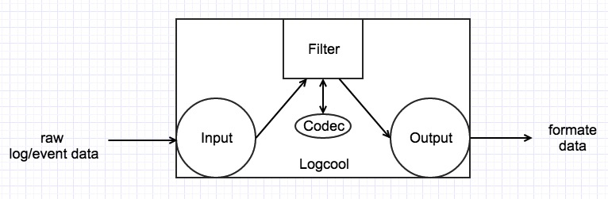

# Introduction

## Overview

Logcool is an open source project to collect, filter ,transfer and response any log or event-flow data as a lightweight system.

Logcool's design learn from Heka and Logstash and it's implementation was inspired by gogstash. What's more, the logcool's goal is to be a completely independent project and not much rely on other non-standard libiaries.Because it is difficult to fully meet the needs of different services, this repository provides basic plugins, such as encryption and decryption of data, compression and decompression of data, data format conversion, support files, command line, http, or the output of any system or redis, influxDB, MySQL database and so on. Importantly, you can easily develop a plugin according to your needs, and easily use it.

# System Requirements

1.Go version1.4+
2.Linux or Windows you like.

# Architecture

The architecture of the logcool is to manipulate data in a plug-in combination.

Input plug-in is the source of the data, it can be a file, network, database or command line and so on; Filter is mainly for the data format and processing, or for decoding the data compression encoding encryption and so on; Output is the data export, output data to the specified system or database.

## Data flow model

# Plugins

## Input

### file

We usually write log into .Log file or some of the important intermediate data, these files reflect the situation of the system in a certain extent, the acquisition of such data has become a very important requirement.

Suppose your log file directory is in the *./tmp/systemname/log* and you only need to fill in the configuration correctly when configuring the input plugin:
"input": [
    {
	    "type": "file", // plugin name
	    "dirspath": ["./tmp/systemname/log"], // watching directory
	    "filetype": ".log", // watching file-type
	    "sincepath": "./tmp/since/.sincedb", // sincedb
	    "startpos": "beginning", // start position
	    "intervals":5 // retry intervals
    }
]
And you can monitor multiple directories at the same time.

### stdin
Like our example, you can enter the data in the command line and its configuration is very simple:

"input": [
    {
        "type": "stdin"
    }
]
### http

## Filter

### zeus

## Output

### stdout

### reids